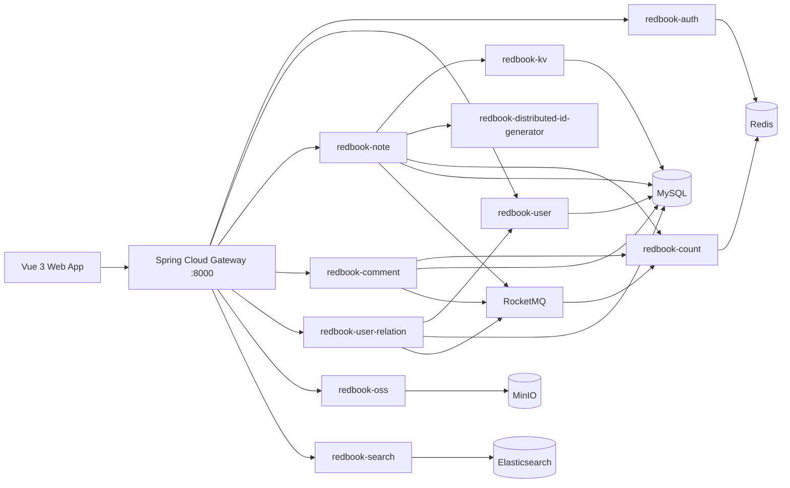

# Redbook Campus

Redbook Campus is a full-stack social content platform inspired by Xiaohongshu. It combines a Java 21 microservice backend with a Vue 3 frontend, delivering image posts, comments, likes, follows, search, object storage, and feed discovery in a pragmatic local-development setup.

This version is intentionally lighter than the original architecture. Cassandra has been replaced by MySQL-backed content storage, ZooKeeper is no longer required by the ID generator, and the default infrastructure can be launched with Docker Compose.

## Highlights

- Image-note publishing with MinIO object storage.
- Feed discovery by channel, note details, deletion, and comment flows.
- Like and unlike support with Redis-backed interaction state.
- Follow and unfollow support with following and fan lists.
- Elasticsearch note and user search.
- Sa-Token based authentication with gateway-level user context propagation.
- RocketMQ driven asynchronous counters and consistency workflows.
- Vue 3 frontend with direct support for publishing, searching, liking, commenting, and following.

## Architecture



## Repository Layout

```text
redbook-campus/
├── redbook/                         # Java 21 multi-module backend
│   ├── deploy/                      # Docker Compose and local database bootstrap
│   ├── red-framework/               # Shared framework starters and utilities
│   ├── redbook-gateway/             # API gateway
│   ├── redbook-auth/                # Authentication
│   ├── redbook-user/                # User profile and account service
│   ├── redbook-note/                # Note publishing, detail, feed, like, collect
│   ├── redbook-comment/             # Comment service
│   ├── redbook-user-relation/       # Follow and fan relationship service
│   ├── redbook-count/               # Counter aggregation
│   ├── redbook-search/              # Elasticsearch search service
│   ├── redbook-oss/                 # MinIO object storage adapter
│   ├── redbook-kv/                  # MySQL-backed note/comment content storage
│   └── redbook-distributed-id-generator/
└── vue3/                            # Vue 3 + Vite frontend
```

## Technology Stack

| Layer | Technology |
| --- | --- |
| Runtime | Java 21, Maven, Node.js |
| Backend | Spring Boot 3.2.4, Spring Cloud 2023.0.1, Spring Cloud Alibaba 2023.0.1.0 |
| Gateway/Auth | Spring Cloud Gateway, Sa-Token |
| Data | MySQL 8, Redis Stack |
| Messaging | RocketMQ |
| Search | Elasticsearch 7.3 |
| Storage | MinIO |
| Frontend | Vue 3, Vite, TypeScript, Axios |

## Local Infrastructure

Docker is the recommended way to run the required middleware.

```bash
cd redbook/deploy
docker compose --profile nacos up -d
```

This starts:

| Service | Port |
| --- | --- |
| MySQL | 3306 |
| Redis | 6379 |
| Nacos | 8848 / 9848 |
| RocketMQ NameServer | 9876 |
| RocketMQ Broker | 10909 / 10911 |
| MinIO API | 9000 |
| MinIO Console | 9001 |
| Elasticsearch | 9200 / 9300 |

Default local credentials are intentionally simple for development:

| Service | User | Password |
| --- | --- | --- |
| MySQL | root | redbook123 |
| MinIO | redbookminio | redbookminio123 |

## Backend Build

```bash
cd redbook
mvn -ntp -DskipTests package
```

The project is configured for Java 21. On Windows, make sure `JAVA_HOME` points to a JDK 21 installation before building.

## Frontend Build

```bash
cd vue3
npm install
npm run build
```

For development:

```bash
npm run dev
```

The frontend defaults to:

```text
http://127.0.0.1:5173
```

The backend gateway defaults to:

```text
http://127.0.0.1:8000
```

## Core API Surface

| Domain | Prefix | Examples |
| --- | --- | --- |
| Auth | `/auth/**` | login, logout, verification code |
| User | `/user/**` | profile, user lookup |
| Notes | `/note/**` | publish, detail, delete, like, unlike, collect |
| Comments | `/comment/**` | publish, list, delete |
| Relations | `/relation/**` | follow, unfollow, following list, fans list |
| Storage | `/oss/**` | file upload |
| Search | `/search/**` | note search, user search, document rebuild |

## Local Verification Checklist

The current implementation has been verified against the following flows:

- Publish an image note through MinIO.
- Retrieve note detail and feed data through the gateway.
- Publish and list comments.
- Like, duplicate-like rejection, unlike, duplicate-unlike rejection.
- Search notes and users through Elasticsearch.
- Follow, duplicate-follow rejection, following list, fans list, unfollow, duplicate-unfollow rejection.
- Vue 3 UI flows for search, note details, like/unlike, follow/unfollow, publishing, and commenting.

## Design Notes

- Cassandra has been removed from the runtime path. Note and comment content now use MySQL-backed repositories in `redbook-kv`.
- ZooKeeper has been removed from Snowflake worker discovery. The ID generator now uses a local worker configuration.
- Redis set-based Lua scripts are used for local note interaction state, replacing unsupported Roaring Bitmap commands in the local Redis Stack setup.
- Canal integration is optional and can be disabled for local development; Elasticsearch documents can be rebuilt through service endpoints.

## License

This project is released under the Apache License 2.0.
